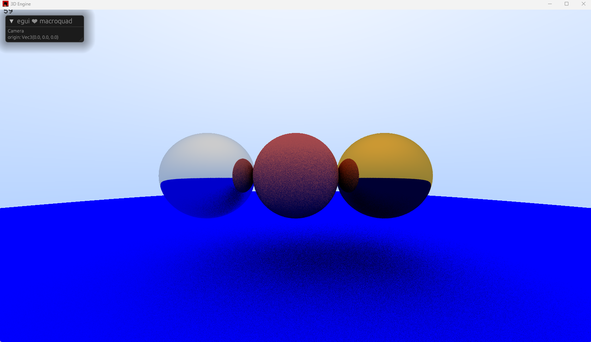

## very simple rust raytracer

This is a little raytracer written in Rust. It uses the [macroquad](https://macroquad.rs) renderer. It is written from scratch following the great guide "Ray Tracing in One Weekend" you can found at [Title](https://raytracing.github.io/books/RayTracingInOneWeekend.html#addingasphere/creatingourfirstraytracedimage)

